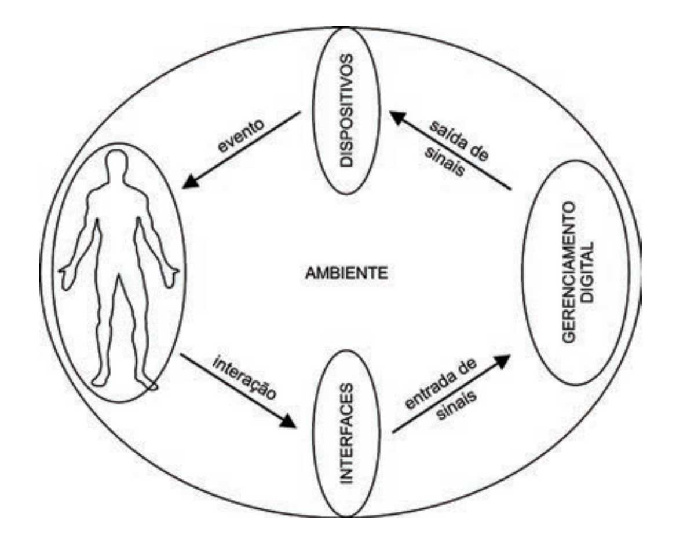
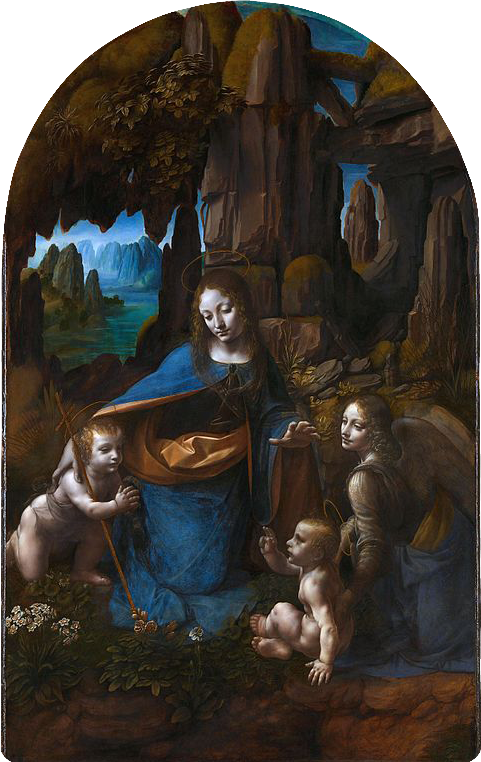
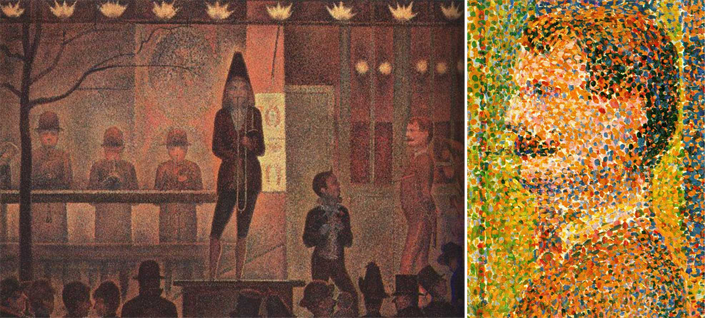
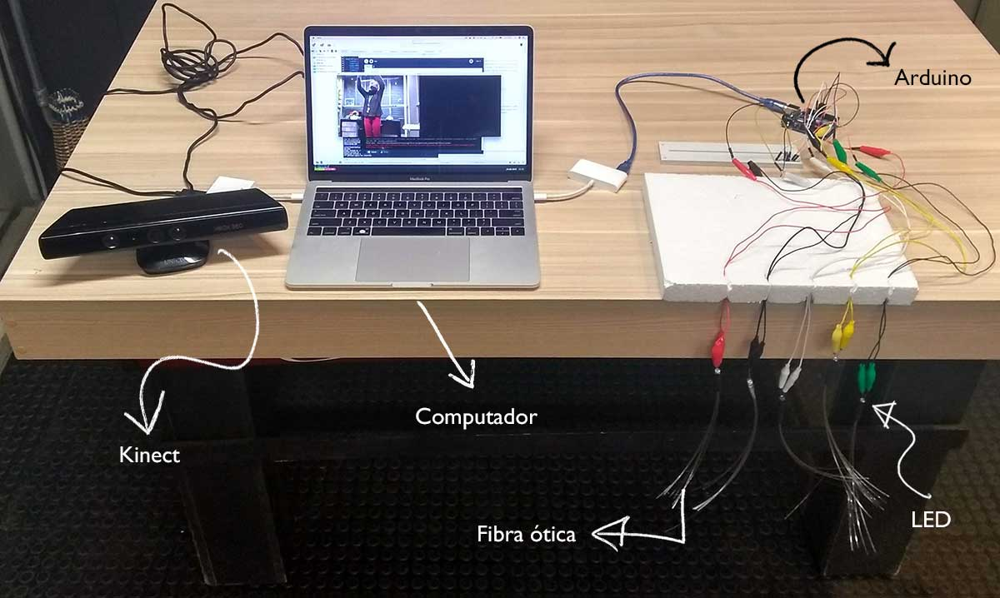
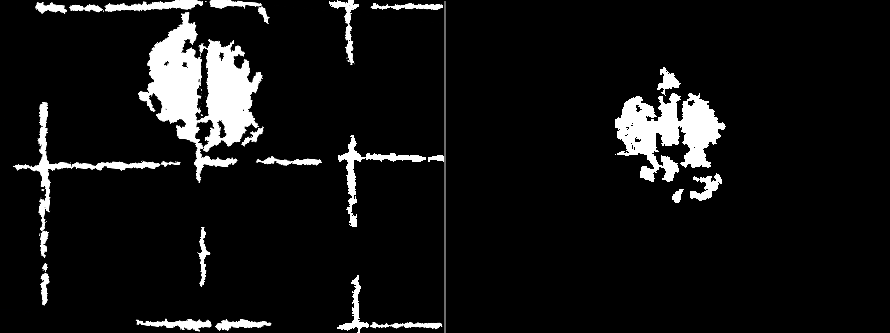
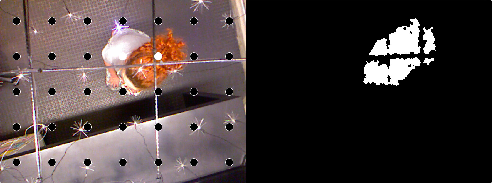
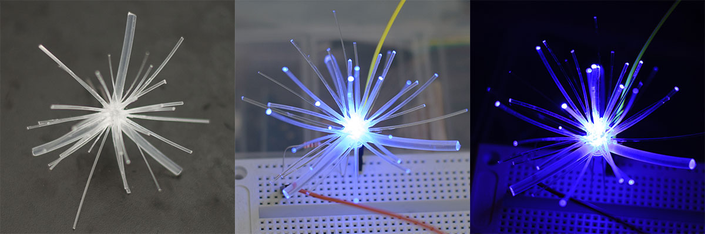
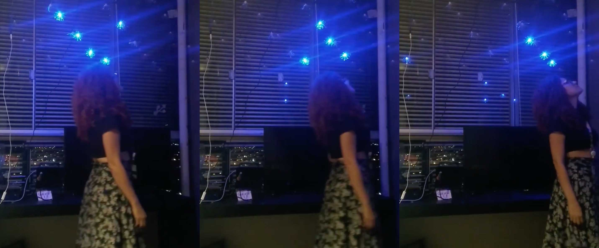
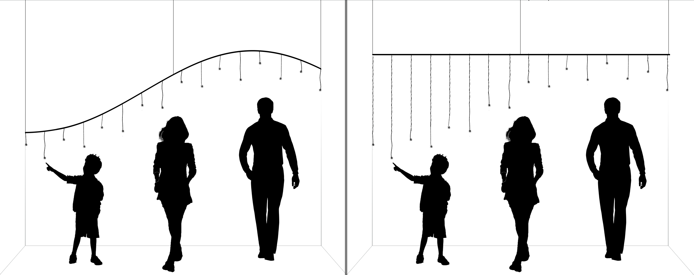

# Arte-Luz-Interatividade: 
## Uma abordagem do uso da tecnologia na arte e da luz como material

---

## Agenda

<small>
- Introdução
- Arte computacional e interatividade
  - Da contemplação à interação
  - Arte computacional
  - Instalações interativas
- A luz como material
  - A luz na história da arte
  - Luz e interatividade
  - O cubo preto
- Composição da obra
  - Dispositivos e tecnologias
  - Prototipação e testes
  - Descrição da solução
- Considerações finais

</small>
---

# Introdução 

----

## Motivações

Note: 
- 16 anos de experiência com tecnologia
- Formação acadêmia em tecnologia
- Relação arte x tecnologia e vice-versa.

---

# Arte computacional e interatividade

Note:
3 temas: interatividade, arte computacional e o unstalações interativas

----

## Da contemplação à interação

Note: 
- Percorreu um caminho até chegar na interatividade: contemplação - participação - interação
- Rahde: 
  - anos 50: arte cinética
- Plaza: 
  - nova forma de comunicação
  - o espectador não está mais reduzido ao olhar
  - a obra se produz no decorrer do diálogo
- Rahde:
  - anos 70: intervenção do público
  - Lygia Clark: desestetização da arte
  - anos 80: novas tecnologias
- Caetano: 
  - era das interfaces
  - desmistificação do computador
- Tavares:
  - processo de realimentação
- Rabello:
  - modelo vivo em constante transformação
- Domingues:
  - Arte interativa avessa a inércia
  - Interfaces = troca
- Plaza:
  - usuário como co-autor    

----

### Graus de interatividade

Note:
- Levy:
  - O receptor nunca é completamente passivo
  - Graus de interatividade
- Couchot: 
  - Exógena (espectador-imagem) x endógena (imagem-imagem)
- Tavares:
  - Ascott: trivial e não trivial
  - Holtz-Bonneau: de seleção e de conteúdo
  - Marie-Hélène Tramus: simulada e real
  - trivial, de seleção ou simulada: o receptor atualiza apenas o potencial de escolhas embutido na obra
  - não-trivial, na de conteúdo ou real: o receptor pode enriquecer e transformar a informação que circula ou que está estocada nos terminais
- Gianetti:
  - 3 tipos de interatividade homem-máquina
    - sistema mediador: onde ocorrem reações pontuais e simples; 
    - sistema reativo: onde o usuário tem acesso multidire- cional ao conteúdo a partir de possibilidades limitadas pela programação e definição do sistema; 
    - sistema interativo de fato, onde o interator passa à função de emissor de informação, podendo intervir, manipular e gerar novos conteúdos
- Primo:
  - reativa: ação e reação (realimentação circular)
  - mútua: complexidade global

----

## Arte computacional

Note:
- Boone:
  - toda arte produzida através de sistemas computacionais
- Venturelli:
  - Entrada e saída de dados
- Lister:
  - arte tradicional: consumo passivo
  - arte computacional: interatividade
- Efemeridade:
  - A mais efemera de todas (Venturelli)
  - Obsolescencia dos dispositivos/efeitos instantâneos (Semeler)
- Rabello:
  - diálogo entre obra e espectador se estabelece de maneira prática
  - usuário ao invés de espectador
  - usuário => significado
  - brincar, experimentar, explorar
- Campbell:
  - o artista não escreve o lado do espectador

----

## Instalações interativas

Note:
- O espaço é incorporado ao conceito do trabalho (Domingues)
- Exploração do espaço pelo público (Sogabe)
- no campo da arte e tecnologia, o conceito de instalação é ampliado para um ambiente onde são criadas situações com dispositivos tecnológicos (Bochio)
- O espaço se torna sensível (Bochio)
- Público como essencial para o acontecimento da obra (Sogabe)
- Necessária a exist6encia de uma interface (Witt e Vares), parte sensível do sistema tecnológico (Sogabe)

----

### O corpo do observador nas instalações interativas

Note: 
- O corpo do observador faz parte da obra (Sogabe)
- A partir da arte cinética os artistas vem solicitando a participação do corpo do observador (Rabello)
- os dispositivos interativos imaginados pelos artistas tendem a solicitar a participação do corpo inteiro (Couchot)
- o corpo da obra já não existe independente do corpo do observador (Sogabe)
- fricção: a do corpo do usuário, orgânico, com um sistema tecnológico, artificial (Witt e Vares)
- o público irá decidir se empresta ou não o seu corpo ao trabalho (Vares)

---

# A luz como material

Note:
- os artistas, em diferentes épocas, se viram inspirados e cativados pela luz, tanto a natural quanto a artificial (Vega)
- artistas contemporâneos: luz como matéria-prima

----

## A luz na história da arte

Note:
- desde os primórdios da humanidade, quando o homem descobria o fogo, a luz sempre desencadeou fascínio (Henno)
- Muga:
  - o paradigma da luz atributo - a luz venerada; 
  - o paradigma da luz efeito - a luz domesticada; 
  - e o paradigma da luz causa - a luz instrumentalizada

----

<small>A lamentação (1305), Giotto de Bondone</small>

Note:
Luz venerada: 
- é percebida essencialmente como um atributo dos objetos, uma propriedade que lhes é inerente e não como um resultado da incidência luminosa.
- o mundo é claro, os objetos são por si só luminosos e as sombras são aplicadas para sugerir rotundidade
- na arte religiosa, os fundos dourados, as auréolas e as línguas de fogo aparecem como atributos brilhantes, representações simbólicas da divindade e não como reflexo da luz

----

<small>A virgem dos rochedos (1495-1508), Leonardo da Vinci</small>

Note:
Luz efeito:
- representação realista da natureza
- Leonardo da Vinci desenvolveu o método chiaroscuro e o sfumato
- tridimensionalidade e a profundidade da representação
- no seio da escuridão que antes atributo do mal, torna-se aliada para se chegar à luz 

----

<small>La Parade (1887-88), Georges Seurat</small>

Note:
- Com o advento da fotografia os pintores precisaram se reinventar.
-  a fotografia influenciou os impressionistas a saírem do ateliês (Muga)
- ao olharmos a natureza ao ar livre e à plena luz do dia, as formas redondas parecem planas, e não vemos os objetos cada um com a sua cor própria, mas uma mistura brilhante de matizes que se combinam nos nossos olhos (Gombrich)
- foi apoiado no preceito de que a cor se mistura no olho e não na paleta que Seurat aplicava pontos de cor na tela (Henno)

----

<video width="800" height="460" autoplay loop muted>
  <source src="images/james_turrell.mp4" type="video/mp4">
</video>

<small>The light inside (1999), James Turrell.</small>

Note: 
Luz causa:
- a função da luz não é mais somente de iluminar (Azevedo)
- A luz passa a ser tratada como objeto ou material

James Turrell:
- investigou os efeitos da luz artificial
- relação entre a luz e a estrutura arquitetônica
- ainda não é tradição utilizá-la em nossa cultura
- não é mais incomum usá-la do que usar pedra, argila, aço ou tinta
- rica tradição na pintura do trabalho sobre a luz, mas que isso de fato não é luz - é o registro da visão

----

<video width="800" height="460" autoplay loop muted>
  <source src="images/jim_campbell_2.mp4" type="video/mp4">
</video>

<small>The Journey (2013), Jim Campbell, localizada no Aeroporto Internacional de San Diego. Fonte: KQED</small>

Note: 
Jim Campbell:
- antítese presente em suas obras
- imagens borradas e em baixa resolução em painéis tridimensionais
- grades de LEDs que atuam como uma televisão de pixels desconstruída

----

## Luz e interatividade

Note:
- aliado ao desenvolvimento da ciência e da tecnologia, o homem de hoje tem condições de gerar e projetar a luz artificialmente ao invés de se restringir aos meios naturais (Henno)

----

<video width="800" height="460" autoplay loop muted>
  <source src="images/tsutomu_mutoh.mp4" type="video/mp4">
</video>

<small>Optone (2009), Tsutomu Mutoh</small>

Note: 
- Devido ao seu peso e à ação da gravidade a cúpula pode ser movimentada sem que a base perca contato com o solo
- movimentos de rotação são detectados por sensores
- associa uma cor às coordenadas pelas quais a cúpula passa

----

<video width="800" height="460" autoplay loop muted>
  <source src="images/takahito_matsuo.mp4" type="video/mp4">
</video>

<small>Fantasias Aquáticas Iluminadas, 2009, Takahito Matsuo.</small>

Note: 
- cria mundos interativos de fantasia e de luz 
- misturando som e luz perante os movimentos do observador
- À medida que os visitantes se aproximam das paredes, se movimentam e se afastam, o número e a frequência das medusas aumentam e diminuem

----

## O cubo preto

> "a maioria dos autores que trabalham com arte e tecnologia procuram o espaço do cubo preto como espaço expositivo"
> 
> <cite>Soares (2013)</cite>

Note: 
- Contaposição ao cubo branco
- Propagação da luz
- Imersão na mente do artista
- projetores de alta luminância (Sogabe)
- quando há pouca ou nenhuma luminosidade, a intensidade das cores é maior e mais perceptível devido ao contraste com a escuridão (Henno)
---

# Composição da obra

----

## Dispositivos e tecnologias

----
### Microsoft Kinect

----

### Arduino Mega 2560
----
### Processing
----
### Computador

----

## Prototipação e testes

----

----

## Descrição da solução

----

----
### Interface
----

----

----
### Gerenciamento digital
----

----
### Dispositivo de saída de dados
----
#### Circuito
----

#### Malha de LEDs

----

----

## Montagem e instalação

----

---

# Consideranções finais

----

---

# Obrigada
