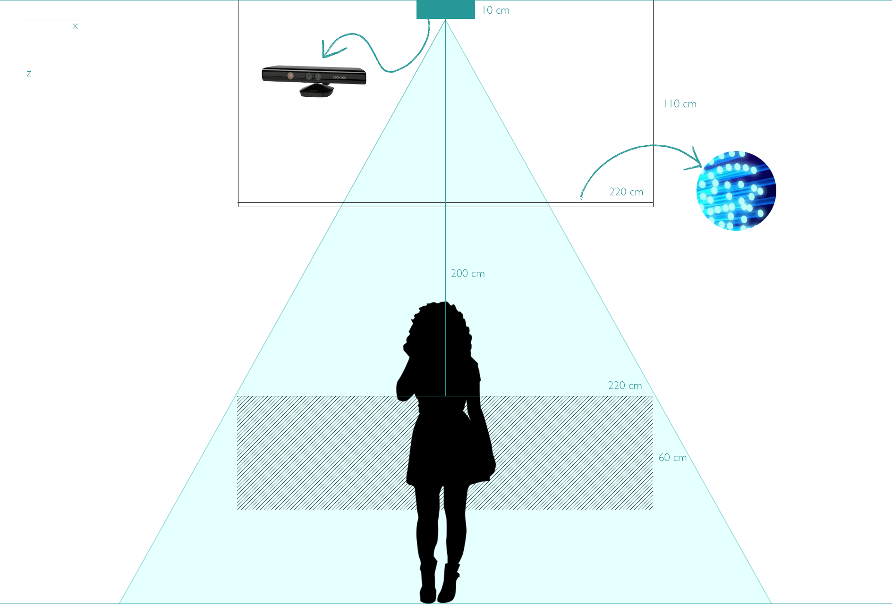
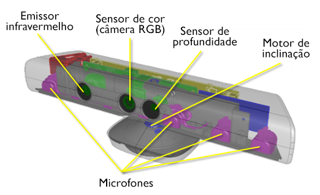
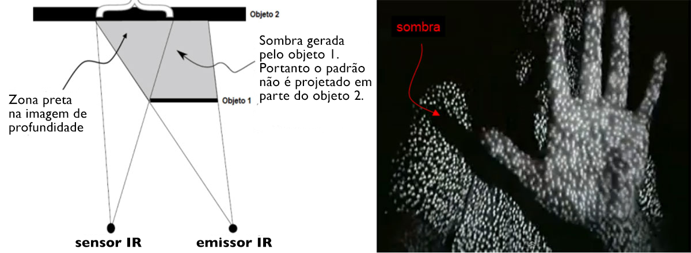

# Aura: luz e tecnologia aplicadas na arte

#### Daniela Feitosa Araújo

<small>Porto Alegre 2018</small>

---

## Agenda

- Introdução
- Interação e participação
- Arte computacional e interatividade
- A luz como material e o cubo preto
- Composição da obra
- Desafios
- Próximos passos

---

# Introdução 

---

# Interação e participação

----

# Da contemplação à interação

----

# O espectador como co-autor

----

# Efemeridade na arte computacional

----

# Obra de arte em tempo real

---

# Arte computacional e interatividade

----

# Arte computacional

> "envolve sistemas computacionais tanto nos seus processos de criação e produção quanto na forma de apresentação"
>
> <cite>BOONE, 2013</cite>

----

# Interatividade na arte computacional

---

# A luz como material e o cubo preto

----

# A luz como objeto ou material 

> "alguns artistas e movimentos estéticos estão fortemente relacionados com a linguagem da luz, mesmo quando não a utilizam como objeto central da obra"
>
> <cite>Brandi (2015)</cite>

----

# James Turrell

<video width="800" height="460" autoplay loop muted>
  <source src="images/james_turrell.mp4" type="video/mp4">
</video>

<small>"The light inside", 1999, James Turrell.</small>

----

#  Takahito Matsuo

<video width="800" height="460" autoplay loop muted>
  <source src="images/takahito_matsuo.mp4" type="video/mp4">
</video>

<small>"Fantasias Aquáticas Iluminadas", 2009, Takahito Matsuo.</small>

----

# Jim Campbell

<video width="800" height="460" autoplay loop muted>
  <source src="images/jim_campbell_1.mp4" type="video/mp4">
</video>

<small>"Light Topography (Jane's Pool)", 2014, Jim Campbell. Fonte: KQED</small>

----

# Jim Campbell

<video width="800" height="460" autoplay loop muted>
  <source src="images/jim_campbell_2.mp4" type="video/mp4">
</video>

<small>"The Journey",  2013, Jim Campbell, localizada no Aeroporto Internacional de San Diego. Fonte: KQED</small>

----

# O cubo preto

> "a maioria dos autores que trabalham com arte e tecnologia procuram o espaço do cubo preto como espaço expositivo"
> 
> <cite>Soares (2013)</cite>

---

# Composição da obra

----

# Microsoft Kinect

----

## Sombras 

----

# Arduino

----

# Malha de LEDs e fibra ótica

----

# Protótipo

----

## Ambiente iluminado

<video width="800" height="460" autoplay loop muted>
  <source src="images/prototipo_luz.mp4" type="video/mp4">
</video>

----

## Ambiente com baixa luminosidade

<video width="800" height="460" autoplay loop muted>
  <source src="images/prototipo_escuro.mp4" type="video/mp4">
</video>

---

# Desafios

- Escalando o trabalho
- Instalação e local expositivo
- Custo

---

# Próximos passos

- Montar a grade de LEDs
- Alterar o script para funcionar com uma matriz
- Buscar alternativa para o problema das sombras

---

# Obrigada
