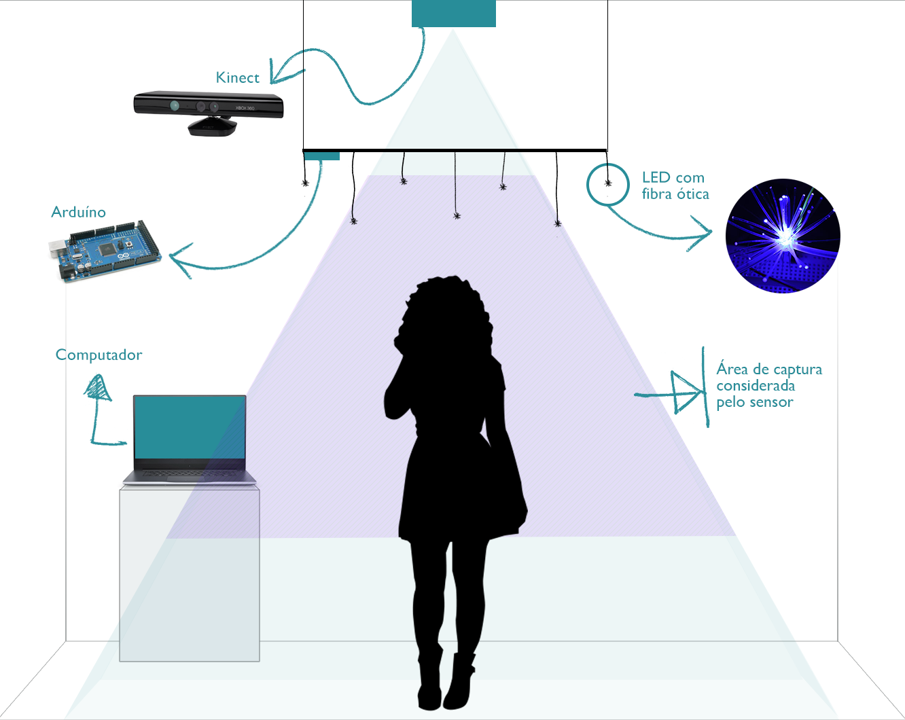

# Arte-Luz-Interatividade: 
## Uma abordagem do uso da tecnologia na arte e da luz como material

---

## Agenda

<small>
- Arte computacional e interatividade
  - Da contemplação à interação
  - Arte computacional
  - Instalações interativas
- A luz como material
  - A luz na história da arte
- Composição da obra

</small>
---

# Arte computacional e interatividade

Note:
3 temas: interatividade, arte computacional e o unstalações interativas

----

## Da contemplação à interação

Note: 
- Percorreu um caminho até chegar na interatividade: contemplação - participação - interação
- Rahde: 
  - anos 50: arte cinética
- Plaza: 
  - nova forma de comunicação
  - o espectador não está mais reduzido ao olhar
  - a obra se produz no decorrer do diálogo
- Rahde:
  - anos 70: intervenção do público
  - Lygia Clark: desestetização da arte
  - anos 80: novas tecnologias
- Caetano: 
  - era das interfaces
  - desmistificação do computador
- Tavares:
  - processo de realimentação
- Rabello:
  - modelo vivo em constante transformação
- Domingues:
  - Arte interativa avessa a inércia
  - Interfaces = troca
- Plaza:
  - usuário como co-autor    

----

## Arte computacional

Note:
- Boone:
  - toda arte produzida através de sistemas computacionais
- Venturelli:
  - Entrada e saída de dados
- Lister:
  - arte tradicional: consumo passivo
  - arte computacional: interatividade
- Efemeridade:
  - A mais efemera de todas (Venturelli)
  - Obsolescencia dos dispositivos/efeitos instantâneos (Semeler)
- Rabello:
  - diálogo entre obra e espectador se estabelece de maneira prática
  - usuário ao invés de espectador
  - usuário => significado
  - brincar, experimentar, explorar
- Campbell:
  - o artista não escreve o lado do espectador

----

## Instalações interativas

Note:
- O espaço é incorporado ao conceito do trabalho (Domingues)
- Exploração do espaço pelo público (Sogabe)
- no campo da arte e tecnologia, o conceito de instalação é ampliado para um ambiente onde são criadas situações com dispositivos tecnológicos (Bochio)
- O espaço se torna sensível (Bochio)
- Público como essencial para o acontecimento da obra (Sogabe)
- Necessária a existência de uma interface (Witt e Vares), parte sensível do sistema tecnológico (Sogabe)

---

# A luz como material

Note:
- os artistas, em diferentes épocas, se viram inspirados e cativados pela luz, tanto a natural quanto a artificial (Vega)
- artistas contemporâneos: luz como matéria-prima

----

## A luz na história da arte

Note:
- desde os primórdios da humanidade, quando o homem descobria o fogo, a luz sempre desencadeou fascínio (Henno)
- Muga:
  - o paradigma da luz atributo - a luz venerada; 
  - o paradigma da luz efeito - a luz domesticada; 
  - e o paradigma da luz causa - a luz instrumentalizada

----

<small>A lamentação (1305), Giotto de Bondone</small>

Note:
Luz venerada: 
- é percebida essencialmente como um atributo dos objetos, uma propriedade que lhes é inerente e não como um resultado da incidência luminosa.
- o mundo é claro, os objetos são por si só luminosos e as sombras são aplicadas para sugerir rotundidade
- na arte religiosa, os fundos dourados, as auréolas e as línguas de fogo aparecem como atributos brilhantes, representações simbólicas da divindade e não como reflexo da luz

----

<small>A virgem dos rochedos (1495-1508), Leonardo da Vinci</small>

Note:
Luz efeito:
- representação realista da natureza
- Leonardo da Vinci desenvolveu o método chiaroscuro e o sfumato
- tridimensionalidade e a profundidade da representação
- no seio da escuridão que antes atributo do mal, torna-se aliada para se chegar à luz 

----

<video width="800" height="460" autoplay loop muted>
  <source src="images/james_turrell.mp4" type="video/mp4">
</video>

<small>The light inside (1999), James Turrell.</small>

Note: 
Luz causa:
- a função da luz não é mais somente de iluminar (Azevedo)
- A luz passa a ser tratada como objeto ou material

James Turrell:
- investigou os efeitos da luz artificial
- relação entre a luz e a estrutura arquitetônica
- ainda não é tradição utilizá-la em nossa cultura
- não é mais incomum usá-la do que usar pedra, argila, aço ou tinta
- rica tradição na pintura do trabalho sobre a luz, mas que isso de fato não é luz - é o registro da visão

---

# Composição da obra

----

----
### Interface
----

----

----
### Gerenciamento digital
----

---

# Obrigada
