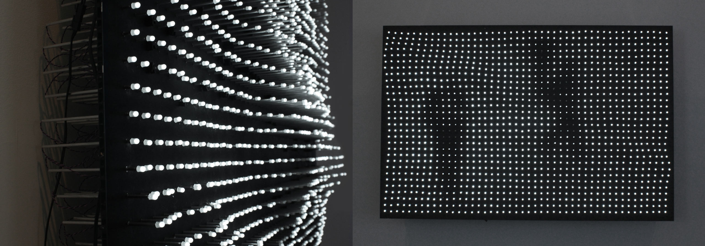
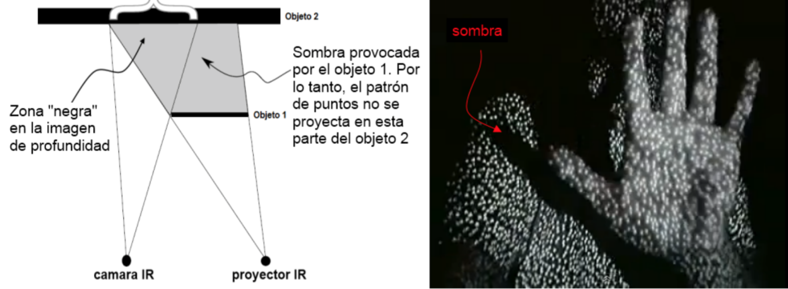

# Introdução

*AURA: luz e tecnologia aplicadas na arte* traz à tona a perspectiva da arte computacional, que "envolve sistemas computacionais tanto nos seus processos de criação e produção quanto na forma de apresentação" \cite[p. 36]{boone}, e tem como base a construção de um *software*, bem como a utilização dispositivos eletrônicos, como o computador, Microsoft Kinect e Arduino, para a criação de um ambiente tridimensional e interativo que reage de acordo com a presença do espectador.

Nesta proposta será apresentada uma obra interativa que tem a luz como fonte principal de sua constituição estética. As variações captadas através do sensor Kinect, conectado a um computador, causam o acender e apagar de LEDs (diodo emissor de luz) dispostos em uma malha pendurada no teto. Essa malha é gerenciada por uma placa Arduino. Cada LED, por sua vez, está conectado à fios de fibra ótica que transmitem a luz emitida por eles, causando um efeito de minúsculos pontos de luz que acompanham o espectador à medida que este caminha pelo espaço.

A presença do espectador, estimulada através do sensor Kinect, provoca o efeito de luzes que acendem e apagam. Neste momento, o fruidor se torna fator indispensável para a constituição da obra. Torna-se obrigatória a manipulação contemplativa dos objetos de luz  (caminhar sob eles) para a existência da mesma. O processo de comunicação entre a instalação e o fruidor, em si, é a obra. O observador faz parte do processo de realização da mesma. O que remete ao efêmero provocado por essa interação, mas que também está presente no aspecto tecnológico, tanto no *hardware* quanto no *software* utilizados. 

O interesse sobre o tema vem da relação precoce que possuo com sistemas de computação. Surge como uma tentativa de fundir dois universos dos quais me sinto parte: a arte e a tecnologia. Além disso, a proposta traz como base de estudo o papel da luz na arte e como esses trabalhos são influenciados pelo meio no qual são expostos.

A pesquisa engloba imersão na temática, busca de fontes em leituras de textos teóricos, visualização de vídeos e estudos relacionados a eletrônica e a computação. Foram experimentados vários componentes para se obter o resultado proposto. Depois de algumas investidas, chegou-se a composição de LEDs e fibra ótica como elemento luminescente e a utilização do sensor Kinect como entrada de dados devido à maior precisão em comparação com outros componentes testados, como o sensor de distância ultrassônico, por exemplo.

# Arte computacional

Segundo Azevedo (2005, p. 183) "as novas tecnologias introduzem diferentes problemas de representação, abalam antigas certezas no plano epistemológico e exigem a reformulação de conceitos estéticos". 

De acordo com Semeler (2011) "apesar de a preocupação com o efêmero não aparecer como elemento de primeiro plano, ela é decorrente da obsolescência inerente aos dispositivos tecnológicos utilizados, bem como nos efeitos instantâneos produzidos em tempo real pela ação do espectador". 
								
A utilização de novas tecnologias nas artes visuais leva a um certo modo de entender novas relações formais, implicando um novo modo de perceber, compreender, apreciar as configurações que se apresentam à nossa organização perceptiva. Talvez, entendendo como é que a organização perceptiva se processa, consigamos chegar a um conhecimento consciente da percepção e essa consciência talvez nos possa levar a novas maneiras de percepcionar. (AZEVEDO, 2005)

# Interação e participação

Segundo Plaza (2009), foi a partir dos anos cinqüenta que se constituiram, no campo da arte, tendências que traduzem e antecipam as mudanças produzidas pelas tecnologias. O artista se interessa por uma nova forma de comunicação, onde procura a participação do espectador para elaborar a obra de arte, modificando assim o estatuto desta e do autor. A obra deixa de ser fruto apenas do artista e se produz no decorrer do diálogo, em tempo real. O espectador não está mais reduzido ao olhar, ele tem a possibilidade de agir sobre a obra e modificá-la, tornando-se co-autor.
A visão computacional tem um grande papel nessa dinâmica pois são os algoritmos que tornam os trabalhos artísticos mais interativos, imersivos e fazem com que o espectador se constitua como parte da obra. Como visão computacional compreende-se a ideia proposta por Caetano (2009) de que é "a forma pela qual 'o computador enxerga' e 'interpreta as imagens', um conjunto de dados numéricos digitais, uma matriz numérica digital descrevendo qualquer conjunto imagético fisicamente contextualizado."

				
**Assim, a outra propriedade que permeia os dois desdobramentos decorrentes da arte participativa e interativa é a efemeridade. Na arte que utiliza novas tecnologias, particularmente em minha pesquisa artística, a condição de efêmero é real e determinada pelo hardware e pelo software.**

Segundo Plaza (2009, p. 14) “A noção de “arte de participação” tem por objetivo encurtar a distância entre criador e espectador. Na participação ativa o espectador se vê induzido à manipulação e exploração do objeto artístico ou de seu espaço.”									
Nas artes da interatividade, portanto, o destinatário potencial torna-se co-autor e as obras tornam-se um campo aberto a múltiplas possibilidades e suscetível a desenvolvimentos imprevistos numa co-produção de sentidos. É assim que nasce a chamada inteligência distribuída ou “coletiva”. (PLAZA, p. 20)				
						
Uma obra de arte interativa é um espaço latente e suscetível a todos os prolongamentos sonoros, visuais e textuais. O cenário programado pode se modificar em tempo real ou em função da resposta dos operadores. A intera- tividade não é somente uma comodidade técnica e funcional; ela implica físi- ca, psicológica e sensivelmente o espectador em uma prática de transformação. (PLAZA, p. 20)

# O cubo preto

# A luz como material

Segundo Azevedo (2005) a problemática da luz atravessa a história da arte, de finais do século XIX e durante o século XX. A função da luz não é mais somente de iluminar, de tornar visível uma obra ou um objecto, ou o mero reflexo dos seus efeitos suspensos no espaço. A luz passa a ser tratada como objecto ou como material. Na perspectiva da arte contemporânea, vemos que, em muitas obras, a luz passa a matéria. 

Para citar alguns exemplos que serviram de inspiração para este trabalho, podemos referenciar o artista japonês Takahito Matsuo que, segundo Soares (2013), cria mundos interativos de fantasia e de luz que fazem parte de uma estética enigmática, misturando som e luz perante os movimentos do observador.  Seu trabalho destaca as diferentes gradações de luz e sombra que contrastando mostram um mundo de fantasia e imaginação. Um desses trabalhos pode ser visto na figura \ref{takahito_matsuo}.

{#takahito_matsuo width=40%}

Fonte: \citeonline{limarka}

A figura \ref{jim_campbell} mostra um trabalho do artista Jim Campbell que, em um mundo de alta definição e telas cada vez mais finas, usa tecnologia para produzir o contrário: imagens borradas e em baixa resolução em painéis tridimensionais. Essas video-esculturas são compostas por grades de LEDs que atuam como uma televisão de pixels desconstruída. 

{#jim_campbell width=100%}

De acordo com Azevedo (2015), "a maioria dos autores que trabalham com arte e tecnologia procuram o espaço do cubo preto como espaço expositivo. Neste espaço o que interessa é um novo ver, um espanto com a imagem". O nome Cubo Negro para este tipo de exposição surge emcontraposição ao Cubo Branco, criado por Brian O'Doherty, num ensaio publicado pela revista Artforum em 1976, fazendo alusão ao espaço das galerias de arte, com paredes brancas, sem janelas isolando o espetador num meio aparentemente atemporal (AZEVEDO, 2015). A ideia do cubo negro surge como ambiente ideal para propagação da luz, mas e também como uma forma de imersão no interior da mente do artista. Dentro do cubo negro estarão os esboços em preto. A proposta onde trabalhos serão vistos por meio da luz e que estarão expostos no interior do cubo.

# Composição da obra

Devido a alta precisão para captar objetos e movimentos optou-se pelo uso do sensor Microsoft Kinect que, conectado a um computador, é responsável por captar a área onde os espectadores se encontram. Integrando-o a uma placa Arduino é possível controlar uma série de LEDs, dispostos em uma grade pendente ao teto. Cada LED possui cabos de fibra ótica side light (com emissão de luz lateral) conectados à ele que se iluminam conforme os espectadores caminham sob a grade. Na figura \ref{esquema} podemos ver um esquema de montagem da obra, sendo que, o sensor Kinect fica preso junto ao teto, a grade com os LEDs se encontra abaixo, a pouco mais de 1 metro de distância, deixando espaço suficiente para os transeuntes.

{#esquema width=80%}

## Microsoft Kinect 

O sensor Kinect é um dispositivo lançado em 4 de Novembro de 2010 como um acessório do console Xbox 360 da Microsoft. Orientado, principalmente, a indústria de jogos, foi criado para servir como uma forma de interação entre o utilizador e o console Xbox 360 através de gestos e comandos de voz. De acordo com a Microsoft (2018), em sua primeira versão, é capaz de capturar imagens com 640×480 pixels a 30 fps. O aparelho é formado por um sensor de profundidade, uma câmera RGB, um acelerómetro, um motor e uma série de 4 microfones. Na figura \ref{kinect_componentes} podemos ver a posição de cada um destes componentes no dispositivo.

{#kinect_componentes width=40%}

Dentre seus componentes, o que mais nos interessa no contexto deste trabalho, é o sensor de profundidade. Ashley e Webb (2012) afirmam que a produção de dados tridimensionais é a principal função do Kinect. Ele difere de qualquer outro dispositivo de entrada justamente porque provê uma terceira dimensão e, para tanto, se utiliza de um emissor e uma câmera de infravermelho. Segundo Lucero (2012) o emissor de infravermelhos projeta um padrão estruturado de luz infravermelha, enquanto a câmera lê esses raios e interpreta a deformação da projeção, convertendo essa informação em valores de profundidade e, consequentemente, medindo a distância entre o objeto e o sensor. De acordo com Correia (2013) estas medidas baseiam-se em triangulação tendo em conta o emissor, a câmera e as posições dos pixels no cenário. A profundidade é codificada numa escala de cinzas. Quanto mais escuro o pixel, mais próximo do sensor está esse ponto no espaço. Sendo que, pixels pretos indicam que não existe informação de profundidade. Isto ocorre no caso dos pontos estarem muito longe, impossibilitando a sua captura, no caso de estarem numa área onde não haja pontos do emissor de infravermelhos, no caso de o objeto refletir mal a luz infravermelha ou, finalmente, no caso de os pontos estarem muito próximos do sensor, uma vez que o campo de visão do Kinect é limitado em cerca de 80 centímetros a 4 metros.

Considerando as limitações do sensor Kinect, a que mais impactou este projeto, é causada pela própria natureza da luz projetada pelo sensor. A luz emitida pelo projetor de infravermelho, ao se deparar com um objeto, gera uma sombra em outro que esteja numa distância maior. Segundo Lucero (2013) o resultado é que não se pode determinar a profundidade em zonas afetadas por estas sombras, como pode ser visto na figura \ref{kinect_sombras}. Dessa forma, estas sombras criam zonas negras na imagem de profundidade, ou seja, pixels com valor zero. O impacto gerado aqui é devido à malha de LEDs se encontrar entre o sensor Kinect e o espectador. A malha projeta uma sombra, criando pontos onde o espectador pode não ser percebido.  Mais detalhes sobre essa questão serão vistos na seção 5.3 Malha de LEDs e fibra ótica.

{#kinect_sombras width=100%}

O Microsoft Kinect foi utilizado como fonte de entrada de dados para mapear o ambiente tridimensional e com ajuda da Processing criar uma malha bidimensional que, mais tarde, é transferida para a estrutura de LEDs. A figura \ref{kinect_exemplo} mostra um exemplo de imagem gerada a partir dos dados capturados pelo sensor. Cada ponto branco apresentado na figura representa um LED aceso na estrutura física, enquanto a área em preto demarca os intervalos entre os mesmos. Não há distinção, na imagem, entre os intervalos e os LEDs apagados. 

{#kinect_exemplo width=40%}

## Arduino

Antes de detalhar o papel do Arduino na obra, propõe-se o entendimento do que é e para que serve, para tanto podemos analisar a descrição presente no site oficial do projeto:

Arduino é uma plataforma de prototipagem eletrônica de hardware livre e de placa única. O objetivo do projeto é criar ferramentas que são acessíveis, com baixo custo, flexíveis e fáceis de usar. Placas arduíno são capazes de ler uma entrada como a luz em um sensor, um dedo pressionando um botão ou uma mensagem do Twitter e transformá-la em uma saída como ativar um motor, ligar um LED ou publicar alguma coisa na internet, por exemplo. É possível dizer à placa o que fazer enviando uma série de instruções ao microcontrolador. Para isso é necessário utilizar a linguagem de programação do Arduino (baseada em Wiring) e o seu software (IDE), baseada em Processing (ARDUINO, 2018). 

Neste trabalho o Arduino foi utilizado para controlar os circuitos da malha de LEDs (saída) recebendo as informações mapeadas pelo sensor Kinect (entrada). Cada LED precisa ser controlado individualmente, por isso optou-se pela utilização do Arduino Mega que possui 54 entradas/saídas digitais, sendo a placa disponível com o maior número de entradas/saídas.

1. O que é mais simples, usar multiplexador ou várias placas Arduino?  Neste caso, quantas placas serão necessárias?
2. Como mapear a entrada (Kinect) para mais de uma saída (Arduino) ou para portas multiplexadas?
3. Qual o desenho do protótipo/projeto?
4. Como fazer o mapeamento dos dados de entrada para os pinos corretos no Arduino?

## Malha de LEDs e fibra ótica

Uma malha de LEDs será construída equivalente a área de captura do Kinect a uma distância de pouco mais de 1 metro do teto. 

1. Qual a estrutura de cada LED?
2. A malha vai interferir na captura de movimentos?
3. Qual a distância necessária entre os LEDs para que o Kinect capture os movimentos?

# Considerações finais

O aparecimento de novos materiais não convencionais levanta alguma polemica e encontram adversários, principalmente no meio artístico (AZEVEDO, 2015). Por isso, muito me questionei ao longo de minha trajetória sobre o papel que a tecnologia poderia ocupar nas artes. Inclusive impûs resistência para unir a arte à tecnologia, uma área de conhecimento que já ocupava há mais de uma década. 

No âmbito deste trabalho, a aplicação da tecnologia e a utilização artística da luz, levou-me à construção de objetos que emanam luz e que, conectados, se completam com a presença do observador. São colocados num espaço com um percurso indefinido, mas com área limitada. Dentro desta área o observador é convidado a explorar seus movimentos e percepções. A experiência confirma a luz como material plástico essencial e a tecnologia como meio para sua execução, neste caso, tornando secundário o aspecto da instalação; e requer portanto, uma ação por parte dos observadores, já que o deslocamento dessa plasticidade é construído na sua relação com os mesmos.

O trabalho realizado aqui é uma amostra da potencialidade do uso da tecnologia na arte e serve como ponto de partida para pesquisas futuras mais aprofundadas.

